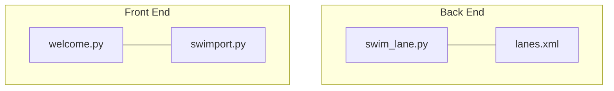

Here is a crude drawing of this project's code structure.

```mermaid
flowchart TD;
subgraph Back End
swim_lane.py --- lanes.xml;
end
subgraph Front End
welcome.py --- swimport.py;
end
```

Coding iz real fun.